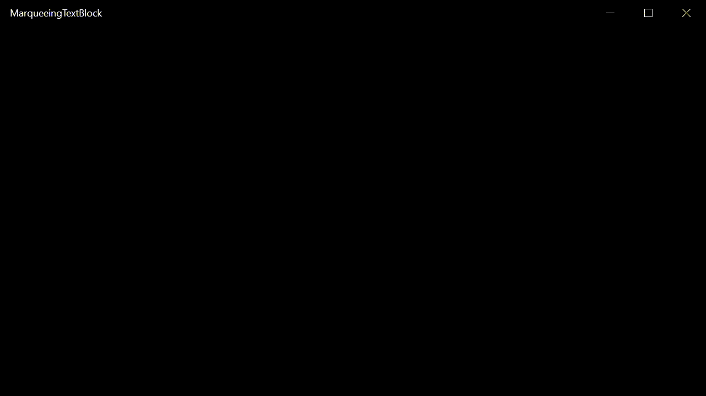

# MarqueeingTextBlock - Project File (Projektdatei)

Putting Marquee effect in TextBlock Lauftext-Effekt in TextBlock anlegen Windows App/Phone, ....

<h2>Examples for / Beispiele für</h2>
<ul><li>Visual Basic</li>
<li>Visual C#</li>
<li>Visual C++</li></ul>
<h2>Demonstration</h2>

(Note: Demonstration is a little bit lagging, original not)  
<h2>Download</h2>

<a href="https://github.com/Paderman/MarqueeingTextBlock/archive/master.zip"><strong>Project file / Projektdatei</strong></a> (for/für VS 2017)

<h2>Original source / Original-Quelle</h2>

<a href="https://github.com/janaks09/MarqueeingTextBlock">janaks09/MarqueeingTextBlock</a> (for/für VS 2015 (C# only))

